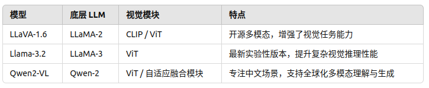

==最新的==

# **Overview**

本文将最近具有代表性的MLLM分为4种主要类型：

- [多模态指令调整](https://zhida.zhihu.com/search?content_id=230278358&content_type=Article&match_order=2&q=%E5%A4%9A%E6%A8%A1%E6%80%81%E6%8C%87%E4%BB%A4%E8%B0%83%E6%95%B4&zhida_source=entity)（MIT）
- 多模态上下文学习（M-ICL）
- 多模态思想链（M-CoT）
- LLM辅助视觉推理（LAVR）

&nbsp;

&nbsp;