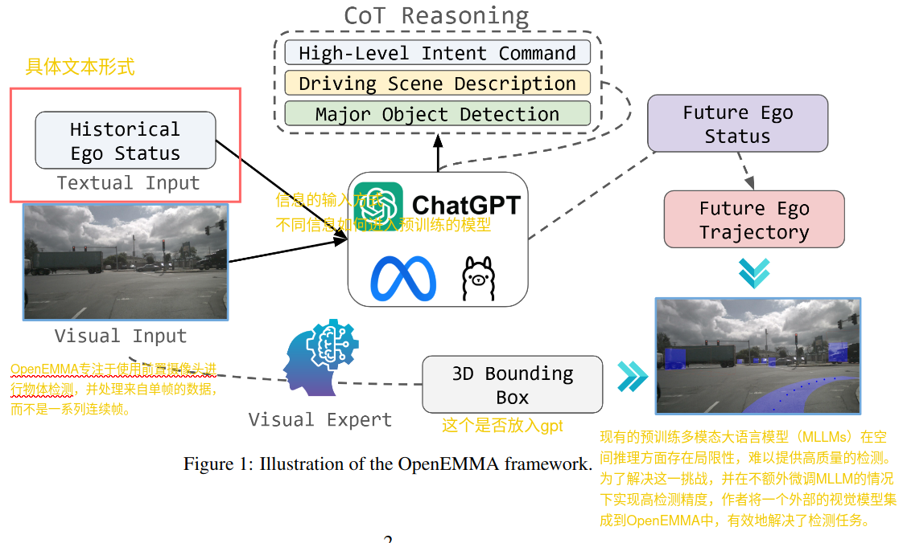
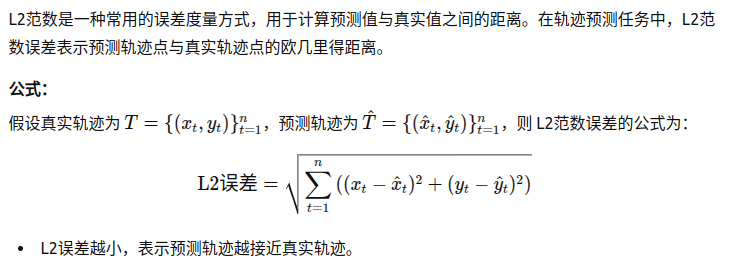
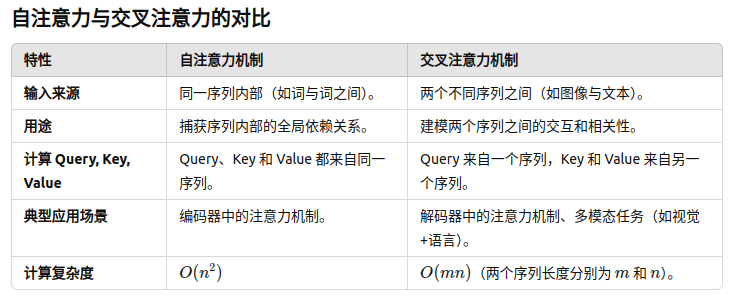
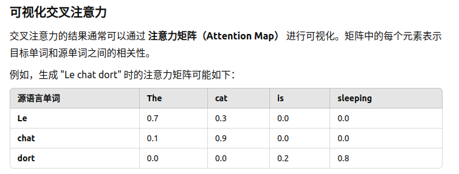
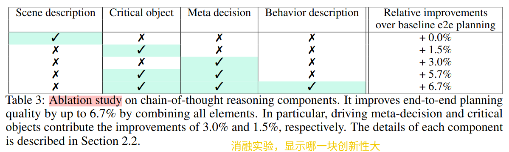

## 经验与汇报

- **经验**：
    - 研究内容时，先查阅国内资源：知乎、CSDN 等。
- **汇报技巧**：
    - 使用流程图，高效清晰地说明流程。

* * *

## 一、多模态大模型的基本原理与训练步骤

### 1\. 基本概念

- **多模态学习**：结合不同模态（图像、文本、音频、视频）信息，训练统一模型。
- **基础知识**：
    - LLMs（大语言模型）
    - CoT（Chain of Thought，思维链推理）
    - 显式监督微调
- **大模型特点**：
    - 上下文信息丰富
    - 生成能力强
    - 适用于多任务

### 2\. 核心技术

- **模态对齐**：通过共享表示或对比学习实现模态联合表示。
- **预训练-微调框架**：结合无监督预训练和监督微调。
- **显式监督微调**：设计标注数据集，通过显式监督优化模型性能。

### 3\. 训练流程

1.  **数据预处理**：清洗和增强多模态数据（如图像-文本对）。
2.  **模态编码**：提取模态特征（如 Transformer 用于文本，CNN 用于图像）。
3.  **模态对齐**：通过对比学习、联合损失实现模态间对齐。
4.  **任务微调**：设计任务特定的损失函数（如分类、生成、理解）。
5.  **模型推理**：结合上下文信息生成结果。

* * *

## 二、视频理解与解释

### 1\. CoT 推理

- 分步推导视频内容，结合时间上下文形成整体理解。

### 2\. 显式监督

- 利用人工标注的视频事件和动作描述数据进行学习。

### 3\. 关键点

- 视频特征提取（如动作识别）
- 时间上下文建模（如使用时序 Transformer）

* * *

## 三、研究目标与计划

### 1\. 周末计划

- 研究大模型能力：
    
    - ==**上下文理解**（in-context learning）==
    - ==**任务分解**（step-by-step CoT）==
    - ==**推理能力**（举一反三）==

### ==2\. 本周目标==

- 学习技术：
    
    - **微调方法**：
        - 全参数微调
        - 下游任务微调
        - LoRA 微调
    - **扩展词表**
    - **技术组件**：
        - RoPE
        - SwiGLU
        - 各种 Norm 和 Attention

### 3\. 下周目标

- 分析 OpenEMMA：
    - 关键技术与框架。
- 学习训练与推理流程：
    - **训练流程**：数据预处理、模型结构、损失设计。
    - **推理流程**：任务应用与效率评估。
- **Loss 设计**：
    - 分类任务：交叉熵损失。
    - 生成任务：对比损失、感知损失。
- 关键技术：
    - **模仿学习**：
        - 行为克隆（Behavior Cloning）
        - 逆强化学习（IRL）

### 4\. 年前目标

- 梳理 OpenEMMA 的多模态框架与核心技术。
- 理解 YOLO3D 的 3D 目标检测与跨模态特征对齐。
- 研究关键任务：
    - 对齐技术
    - 数据标注与模仿学习

* * *

## 四、推理与预测阶段

### 阶段 1：推理

- 输入：
    - 驾驶场景前摄像头图像
    - 自车辆过去 5 秒的历史数据（速度与曲率）
- 过程：
    - 使用预训练的 MLLMs 推理，生成场景分析：
        - **意图命令**：车辆预期动作。
        - **场景描述**：交通信号、其他车辆、行人行为。
        - **主要物体**：道路使用者及行为描述。

### 阶段 2：预测

- 基于 ==CoT 推理与历史状态==，预测==未来轨迹（速度与曲率）==。
- 整合预测计算最终轨迹。

* * *

## 五、术语与技术说明

### 1\. L2 范数

- 用于衡量模型预测误差，值越小表示模型性能越好。
- 

### 2\. Zero-Shot

- 模型在未微调情况下直接在目标任务上进行预测。
    - **Zero-Shot** **基线：**
        
        - 在 OpenEMMA 的实验中，Zero-Shot 基线指未经过微调的多模态大语言模型（MLLMs），直接对轨迹规划任务进行预测。
            
        - 由于这些模型未见过类似任务或场景，预测结果可能表现较差。
            
    - **实验结果的直接对比：**
        
        - 文中指出，未微调的 MLLMs（Zero-Shot 基线）的 L2 范数误差和失败率都显著劣于经过微调的 OpenEMMA。
            
        - 微调后的 OpenEMMA 在 L2 范数误差和失败率两个关键指标上均优于基线，证明了微调对任务性能的提升。
            

### 3\. CoT 的优势

- 1.  **增强理解能力：**
        
        - CoT 将复杂驾驶场景逐步分解，使模型能够更深入地理解环境中的关键要素。
            
        - 例如：模型需要先识别障碍物的 3D 位置、意图，然后推导出自车的最佳运动轨迹。
            
        - 这种逐步推理使得模型在复杂场景中能更精确地处理环境信息。
            
    2.  **提高推理透明度和一致性：**
        
        - CoT 的中间步骤输出让推理路径更加清晰，减少逻辑错误，增强轨迹生成的合理性。
            
        - 例如：如果在中间步骤中发现某个逻辑不合理，模型可以调整其推理过程，而不是直接输出错误轨迹。
            
    3.  **对复杂驾驶场景的适应能力：**
        
        - CoT 能有效处理具有动态特性的驾驶场景，如多目标冲突、复杂道路条件等。
            
        - 例如，在遇到行人穿越或其他车辆超车时，CoT 能逐步分析并生成合理的避让策略。
            

## 自注意力与交叉注意力
### 交叉注意力
- **作用机制**：在机器翻译等任务中，交叉注意力会依据目标语言的上下文以及源语言的全局上下文，精准判断源句子里哪些单词与当前正在生成的单词最为相关。通过这种方式，能够在源语言和目标语言之间高效地构建起映射关系，助力模型更好地理解两种语言间的语义关联，从而提升翻译的准确性与流畅度。举例来说，在将英文句子翻译成中文时，交叉注意力可以确定英文句子中的各个词汇在生成对应中文词汇时的重要程度。

### 自注意力
- **作用机制**：自注意力主要聚焦于单个序列，它让序列中的每个元素都能与自身序列中的其他元素进行关联和交互，计算序列中元素之间的相对关联程度，从而捕捉到序列内部的长距离依赖关系和全局信息。比如在处理一个文本序列时，自注意力可以帮助模型理解文本中不同位置词汇之间的语义联系，即使它们相隔较远。
- 
- 

## 消融实验
### 自动驾驶任务中的消融实验
1. **模型**：基于视觉的自动驾驶系统。
2. **目标**：深入分析不同输入特性对轨迹预测所起到的贡献。
3. **实验设置**
    - **移除环视摄像头输入**：仅保留前视摄像头，以此观察缺少环视信息后对轨迹预测的影响，判断环视摄像头提供信息在整体预测中的重要性。
    - **移除历史速度和曲率信息**：仅使用当前帧的信息，探究历史运动信息对轨迹预测的必要性和贡献程度。
    - **去掉Chain - of - Thought推理过程**：直接生成轨迹，分析推理过程在生成合理轨迹中的作用。
4. **结果分析**：通过比较每种配置下的预测误差，例如轨迹偏差或最终目标到达率，来定量评估各输入特性的重要性。误差变化越大，说明对应被移除的输入特性对模型性能影响越大。
5. 

### 类似概念和方法总结
1. **模块级分析**
    - **消融实验**：通过有针对性地移除模型中的特定模块或组件，观察模型性能的变化，以此来评估该模块对整体模型功能和性能的贡献。
    - **模块测试**：对模型中的各个模块单独进行测试，验证其功能是否符合预期，定位模块内部可能存在的问题。
    - **伪消融实验**：并非真正移除模块，而是通过特定手段模拟模块缺失的效果，同样用于分析模块的作用。
2. **输入级分析**
    - **特征重要性分析**：通过各种方法评估输入特征对于模型输出结果的重要程度，帮助确定哪些特征是关键的，哪些可能是冗余的。
    - **输入遮掩分析**：对输入数据的某些部分进行遮掩或去除，观察模型性能的变化，以此了解不同输入部分对模型的影响。
3. **鲁棒性分析**
    - **对抗攻击**：通过向输入数据中添加精心设计的对抗扰动，测试模型在面对对抗样本时的鲁棒性，评估模型抵御攻击的能力。
    - **平衡实验**：调整数据集中不同类别或条件的数据分布，观察模型性能是否稳定，以此分析模型对数据分布变化的适应能力。
4. **性能调优**
    - **超参数敏感性分析**：研究超参数的变化如何影响模型的性能，从而找到最优的超参数设置，提升模型性能。
    - **模型剪枝**：去除模型中对性能影响较小的参数或连接，在不显著降低模型性能的前提下，减少模型的复杂度和计算量。 