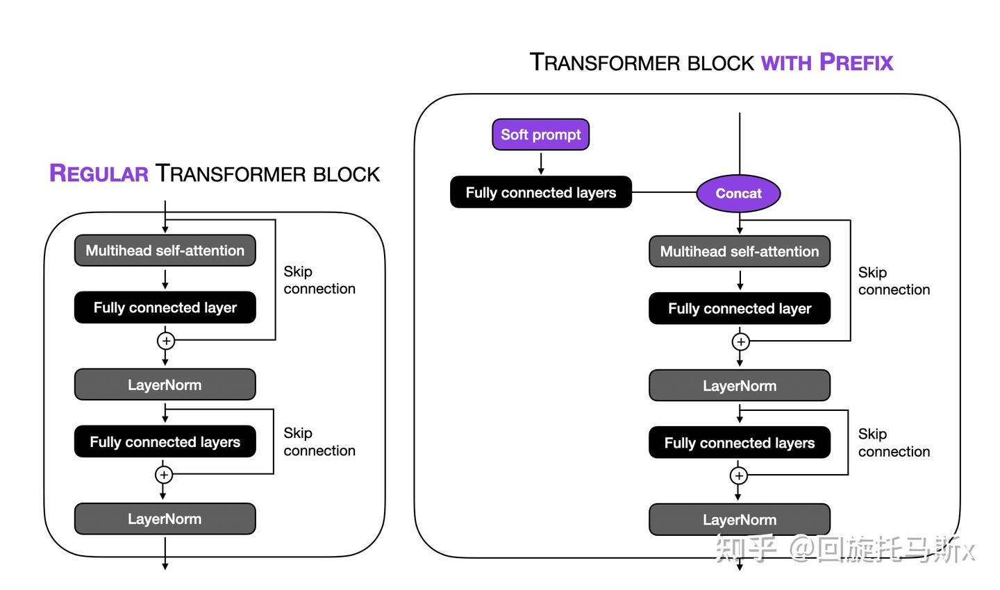
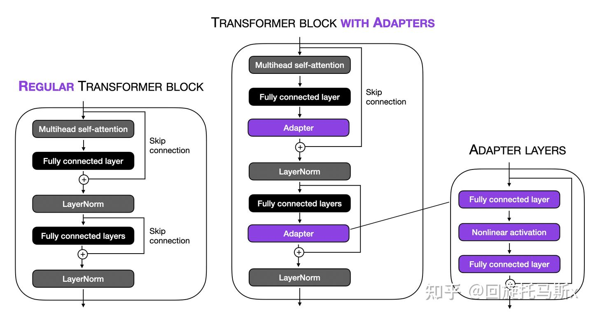
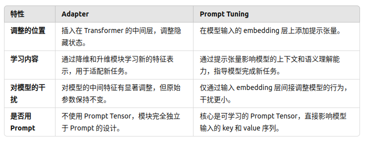
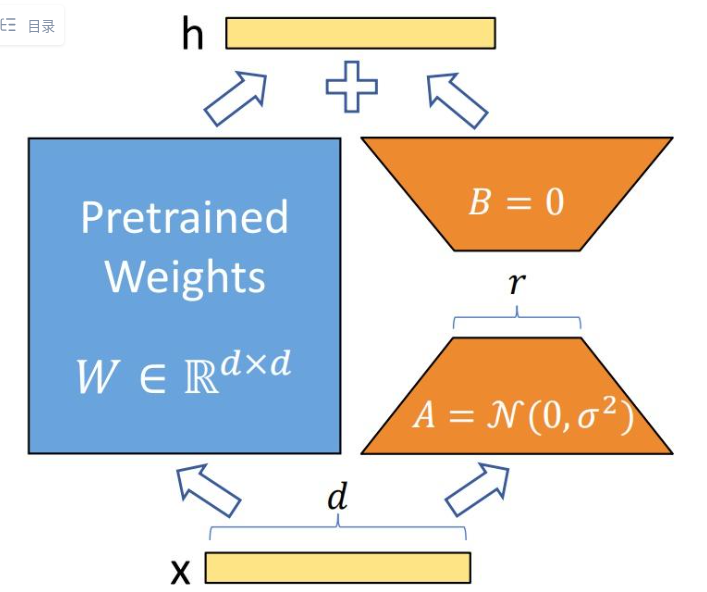

参考：https://zhuanlan.zhihu.com/p/635710004

* * *

&nbsp;

# Prompt tuning

**硬提示（Hard Prompt）**：

- 硬提示就是直接在输入的文字上下功夫，比如给一个大语言模型提示：“请回答下列问题：今天的天气怎么样？”
- 我们手动修改这段文字提示，尝试用不同的措辞，比如换成：“告诉我今天的天气情况。” 或 “今天天气如何？” 来观察模型表现的好坏。
- **特点**：这种方式是静态的、不可调的，只能通过试错调整提示内容，不能通过算法优化。

&nbsp;

**软提示（Soft Prompt）**：

- **Soft Prompt Tuning** 是硬提示的升级版，不再手动修改提示，而是通过训练一种“隐藏提示”的方式，帮助模型更好完成任务。
- 将一个特殊的“提示”表示为**向量（张量）**，然后把这个提示向量和输入文字的“向量表示”==拼接==在一起。
- ==**这个“提示向量”是可训练的，可以通过算法和反向传播不断调整它的值，让模型更高效地完成目标任务。**==
- **特点**：软提示是动态优化的，可以通过数据训练获得最优提示，模型的效果也因此提升。

&nbsp;

**Prompt Tuning 与模型大小的关系**

- Prompt Tuning **只训练提示张量，而==不改动模型原始参数==**。因为大模型本身已经掌握了丰富的知识，提示只是“引导”它调用知识来完成具体任务。
- **大模型更适合 Prompt Tuning**：随着模型变大（例如从几亿参数到上千亿参数），它的知识储备更多，设计合适的提示就显得更重要，因此 Prompt Tuning 的效果会越来越好。

&nbsp;

# Prefix tuning

prefix tuning与prompt tuning相似，将一个特定任务的张量添加到输入，这个张量是可训练的，保持预训练模型的参数不变。主要区别如下：

1\. prefix tuning将prefix参数（可训练张量）==添加到所有的transformer层==，而prompt tuning==只将可训练矩阵添加到输入embedding==。具体地，prefix tuning会将prefix张量作为past_key_value添加到所有的transformer层。

2\. 用一个独立的FFN来编码和优化prefix参数，而不是直接优化soft prompt，因为它可能造成不稳定并损害性能。在更新完soft prompt后，就不再使用FFN了。



&nbsp;

# Adapter

adapter\[16\]在某种程度上与prefix tuning是类似的，二者都是把额外的可训练参数添加到每个transformer层。不同之处是：prefix tuning是把prefix添加到输入embedding；==而adapter在两个位置插入了adapter 层==，如下图所示。





&nbsp;

假设我们有一个预训练的 **GPT-3** 模型，这个模型已经在大规模文本数据上进行了训练，具备了强大的语言理解和生成能力。现在，我们希望将这个预训练模型调整（微调）为能够进行 **情感分析**，也就是判断输入文本的情感是积极的、消极的，还是中立的。

### **步骤 1：插入 Adapter 模块**

- 假设我们决定在 GPT-3 模型的某些 **Transformer 层** 后插入 Adapter 模块。这些层在模型的运作中负责理解输入文本的语法、上下文等信息。
    
- **Adapter 模块的作用**：这些 Adapter 模块是一个小型的神经网络，它们能够学习特定任务（如情感分析）的相关信息。可以类比成是“调音器”，帮助模型专注于情感分析任务的细节，而不需要对原有模型的复杂结构做任何大的修改。
    
- **工作方式**：Adapter 模块的==输入==是 GPT-3 在某一层计算得到的==隐藏状态==（通常是一个向量，包含了该层对输入文本的理解）。然后，Adapter 模块==通过其自己的参数==（这些参数是随机初始化的）来==调整这个向量==，使其更适合情感分析的任务。经过 **Prompt Tensor** 修改的输入序列经过 **模型的多个层**（如 Transformer 层）后，最终生成 **隐藏状态**。
    

### **步骤 2：训练 Adapter**

- **训练过程**：在训练时，我们<span style="color: #e03e2d;">**只会训练 Adapter 模块的参数，而不会改变 GPT-3 的参数**</span>。GPT-3 已经通过大量数据学习了语言的基础知识，所以我们不需要重新训练它。我们仅仅让 Adapter 模块来学习如何根据 GPT-3 的输出生成适合情感分析的结果。
    
- **情感分析任务**：情感分析的标签可能是“积极”、“消极”和“中立”。在训练过程中，模型会学习如何根据给定文本的情感标签调整 Adapter 模块的参数。比如，模型会通过反向传播来优化 Adapter 层，让它能更好地区分积极、消极和中立的文本。
    

&nbsp;

### **LLaMA-Adapter 的特点**

**LLaMA-Adapter 是一种结合 **Prefix Tuning** 和 **Adapter** 技术的微调方法**

- 像 Prefix Tuning 一样，在模型的输入 embedding 上添加一组可训练的提示张量。
- 引入 **门控机制** 和 **注意力机制**，让这些提示张量在训练开始时“零影响”（即不干扰原模型的知识），以便模型可以稳定地微调。

1.  **只调整深层 Transformer 层**：
    
    - 它只在模型的 **深层 L 个 Transformer 层** 中添加可学习的提示张量，而不是每一层都调整。
    - 原因：深层的 Transformer 层更关注高级语义信息，调整这些层更有效。
2.  **引入门控机制**：
    
    - 门控因子（Gating Factor）在训练初始阶段被设置为零，防止提示张量直接修改模型的行为。
    - 随着训练的进行，门控因子逐渐开放，提示张量的影响才开始显现，这样能保证模型训练的稳定性。
3.  **软提示（Soft Prompt）的区别**：
    
    - 与 Prefix Tuning 不同，LLaMA-Adapter 的提示张量 **只修改输入的 key 和 value 序列**，而不修改 query（查询）。
    - 这种设计可以减少对原始注意力机制的干扰，让模型更好地保持原有的语义能力。

&nbsp;

# **LoRA (Low-Rank Adaptation)**

一种用于预训练大语言模型的微调方法，基于 **低秩矩阵分解** 的理论来高效地进行模型微调。其核心思想是：即使预训练语言模型的权重参数非常复杂，也可以通过将这些权重更新限制为低维度的子空间，仍然能够有效地进行任务适应或微调。

**低秩假设**：有研究表明，尽管模型的权重矩阵很大，但实际上它们的内部结构可能是低秩的。也就是说，模型的权重矩阵可以通过 **低秩矩阵分解** 来近似，这样就能减少计算量并提高效率。

### 核心策略

1.  **旁路模块的引入**  
    对于每个预训练的模型层，尤其是 **self-attention 层** 中的 **query** 和 **value** 矩阵，LoRA 会插入一个 **旁路模块**（也叫做低秩模块），它的维度较小，训练时只更新这个旁路模块中的参数。
2.  **权重更新的方式**

- 假设原始的权重矩阵为 $W$，LoRA 不直接更新 $W$，而是将更新限制为两个低秩矩阵的乘积 $A\times B$。
- 其中，$A$ 和 $B$ 是小维度的矩阵。通过这种方式，LoRA 在训练时只更新这两个较小的矩阵，而不是整个大矩阵。

假设预训练模型中的权重矩阵为 $W_0$，更新后的权重矩阵为：

$$
W = W_0+\Delta W
$$

其中，LoRA 将 (\\Delta W) 表示为两个低秩矩阵的乘积：

$$
\Delta W = A\times B
$$

$$
A\in\mathbb{R}^{d\times r},\ B\in\mathbb{R}^{r\times d},\ \text{where } r\ll d
$$

通过这种低秩分解，显著减少了参数量。



## 2\. LoRA 的具体实现

在微调过程中：

- **冻结原始权重**：在训练的开始阶段，模型的原始权重矩阵 W 会被冻结，即这些权重不参与梯度更新。
    
- **训练低秩矩阵**：训练时，LoRA 仅训练旁路矩阵 A 和 B 。这些矩阵的初始值通常是随机的，例如采用 **高斯分布** 初始化。随着训练的进行，LoRA 会优化这两个低秩矩阵，从而实现任务的适应。
    
- **旁路模块的作用**：旁路模块的作用是捕捉模型权重更新的低秩变化，通过低秩矩阵的乘积来调节模型的表现，而不需要全模型的参数更新。
    

&nbsp;

* * *

# **Prompt Tensor**

#### 1\. **传统微调方式**

传统方法需要：

- **解冻模型权重**：对模型的大部分或全部参数进行更新。
- 计算开销大：需要为每个任务训练一整套新模型参数。

**Prompt Tensor 不同之处在于：只添加小规模的提示张量，而不调整模型的原始权重。**

* * *

#### 2\. **Prompt Tensor 的具体实现**

在使用 Prompt Tensor 时，我们将**一组可学习的张量**作为模型的提示，直接嵌入到 Transformer 的结构中，比如 **输入嵌入层** 或 **注意力机制**。

**(1) Prompt Tensor 的初始化**  
Prompt Tensor 是一个矩阵，形状可能是：

\[P,d\]

- P：Prompt 的长度，比如 5。==转化为5个向量==。
- d：Transformer 模型的==隐藏维度==，比如 768（GPT 模型中常用）。
- 示例：  
    假设 Prompt Tensor 是一个大小为 5×7685 \\times 768 的矩阵：

```plaintext
Prompt Tensor = [
    [0.1, -0.5, ..., 0.2],  # 第1个向量
    [0.3, 0.2, ..., -0.1],  # 第2个向量
    ...
    [0.4, -0.3, ..., 0.5]   # 第5个向量
]
```

**(2) 将 Prompt Tensor 添加到输入**  
Prompt Tensor 被附加到句子的输入嵌入（Input Embedding）中。例如：

- 假设输入句子是：*"The movie was absolutely fantastic, I loved it!"*。
- 将句子转为 Token（词元）后，生成一组嵌入矩阵（Input Embedding）：

$$
\text{Input Embedding} = [\mathbf{E}_1, \mathbf{E}_2, ..., \mathbf{E}_n]
$$

每个 $\mathbf{E}_i$ ==是一个向量，表示句子中第== $i$ ==个词的嵌入==。

- 将 ==Prompt Tensor 作为“前缀”，添加到 Input Embedding 的前面==：

$$
\text{Modified Input} = [\mathbf{P}_1, \mathbf{P}_2, ..., \mathbf{P}_P, \mathbf{E}_1, \mathbf{E}_2, ..., \mathbf{E}_n]
$$

- $\mathbf{P}_i$：Prompt Tensor 中的第 $i$ 个向量。次例子中一共==5个==
    
- $\mathbf{E}_i$：句子中第 $i$ 个词的嵌入。
    
- 输入的总长度从 $n$ 变为 $n + P$。
    

**(3) Prompt Tensor 的优化**  
Prompt Tensor 的值是随机初始化的，最开始并没有特定的意义。在训练过程中：

- 模型通过梯度下降==调整 Prompt Tensor 的值，让它学会生成<span style="color: #e03e2d;">对任务有用的提示</span>==。
- Prompt Tensor 的训练目标是帮助模型更好地完成分类任务，而无需调整模型其他部分的参数。

* * *

### **实际效果**

1.  **无 Prompt Tensor**：  
    模型可能需要几百万甚至上亿参数的调整，才能适应新任务。
    
2.  **有 Prompt Tensor**：
    

- 模型的权重冻结，只训练一个很小的张量（Prompt Tensor）。
- Prompt Tensor 起到了“任务信号灯”的作用，告诉模型：“这是一项情感分类任务，请根据提供的提示进行调整”。
- 训练效率大幅提高，占用显存也更少。

&nbsp;

# 高效参数微调实践

## 一、实验环境与设置

使用 huggingface 的 PEFT 库实现高效参数微调方法。

在单机 8 卡的 40GB A100 上进行训练。

采用 deepspeed 框架的 ZeRO stage3 和 CPU offload，开启 float16 的混合精度训练，不进行激活重计算。

单卡 batch_size 为 4，最大序列长度为 512，梯度累加步数为 4，学习率设置为 1e-4。

在 alpaca chinese 数据上训练 3 个 epoch。

&nbsp;

### 微调方法效果对比总结表格

| **基座模型** | **全量微调效果** | **LoRA** | **LLaMA-Adapter** | **Prompt Tuning** | **Prefix Tuning** | **备注** |
| --- | --- | --- | --- | --- | --- | --- |
| **LLaMA-7B** | 最优，训练损失低，但验证损失较早出现过拟合 | 次优，效果仅略逊于全量微调 | 明显优于Prompt和Prefix Tuning | 效果较差，但略优于Prefix Tuning | 效果较差，可能因随机初始化张量损害预训练模型语义知识 | Prompt和Prefix Tuning无法生成流畅的中文回复；指令微调后效果有所提升 |
| **Chinese LLaMA-7B** | 不可比较，但扩展词表后生成中文效果更好 | 基本与全量微调相当 | 优于Prompt和Prefix Tuning | 效果较差，中文生成能力有限 | 效果较差，中文生成能力有限 | 扩展词表显著提升中文生成效果；LoRA生成的回复好于LLaMA-Adapter |
| **ChatGLM-6B** | 效果良好，但生成内容偏短 | 好于全量微调 | \-  | 简单生成，效果一般 | 简单生成，效果一般 | 生成的回复偏短，内容较简单 |
| **BLOOM-7B** | 与Prompt和Prefix Tuning相当，出现过拟合 | 优于全量微调，验证损失更低 | \-  | 可生成流畅中文回复，但略逊于Prefix | 中文回复优于Prompt Tuning | Prefix Tuning生成的中文回复效果较好 |

* * *

### 总结

1.  ==**LoRA方法**整体效果最佳==，几乎在所有基座模型上都表现出与全量微调接近甚至更优的性能，且有效避免了过拟合问题。
2.  **Prompt Tuning与Prefix Tuning**效果==普遍较差==，尤其在LLaMA系列模型上无法生成流畅的中文回复，但在BLOOM中Prefix Tuning略优于Prompt Tuning。
3.  **全量微调**尽管效果理想，但容易出现过拟合问题，验证损失较高。
4.  扩展词表对非中文预训练模型的中文生成能力提升显著，例如Chinese LLaMA对比LLaMA。
5.  ChatGLM模型在高效微调后生成的内容偏短，简单性较高。