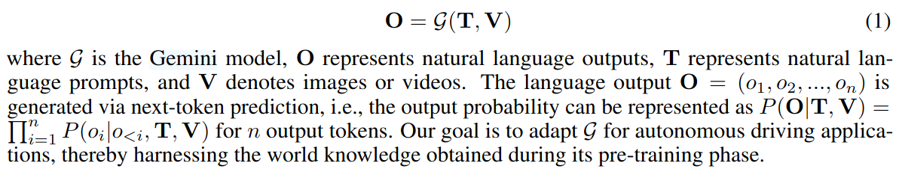

## 1\. 论文阅读 - OpenEMMA

### **论文介绍**

****

****

- **输入**：
    1.  高级命令（如导航地图）。
    2.  自车的历史状态（过去 5 秒的速度与曲率）。
    3.  环视摄像头的视频（==OpenEMMA== 仅使用前摄像头图像）。
- **3D 边界框**：
    - 包含 7 个参数：中心位置 (tx, ty, tz)、尺寸 (dx, dy, dz) 和偏航角 θ。
    - 基于 2D 边界框和 3D 估计共同计算。
- **输出**：
    - 预测自车的未来轨迹，生成运动规划。
    - 通过 Chain-of-Thought (CoT) 推理增强模型性能和可解释性。
    - 视觉锚定（Visual Grounding）：预测关键物体的 3D/BEV 位置。

* * *

### **方法与特性**

1.  **输入特性**：
    
    - 使用前摄像头图像和历史状态数据作为输入。
    - 通过特定任务提示（prompts）引导模型推理当前驾驶场景。
2.  **输出生成**：
    
    - 结合 CoT 推理与历史状态，生成未来的速度 S={st}t=0TS = \\{s_t\\}\_{t=0}^T 和曲率 C={ct}t=0TC = \\{c_t\\}\_{t=0}^T。
    - 整合生成的轨迹 T={xt,yt}t=0TT = \\{x_t, y_t\\}\_{t=0}^T。Google Gemini 是 Google 的新一代人工智能模型系列，由 Google DeepMind 开发。它是 ChatGPT 等语言模型的竞争产品，整合了大语言模型 (LLMs) 和生成式人工智能的能力，广泛应用于文本、图像和多模态任务。
3.  **模型特性**：
    
    - **自监督学习**：
        - 无需人为标注，只使用自车未来轨迹作为监督信号。
        - 模型目标是拟合专家驾驶行为。
    - **摄像头输入**：
        - 仅使用摄像头，不依赖激光雷达等额外传感器。
    - **不依赖高清地图**：
        - 除了导航系统提供的高层次路径信息外，不需要高清地图支持。

* * *

## 2\. Chain-of-Thought 推理

### **定义**：

- CoT 是一种增强推理能力的方法，引导模型逐步输出中间思考过程，使推理路径更加清晰。

### **优势**：

1.  **增强逻辑一致性**：
    - 强调中间步骤输出，减少逻辑错误，提高模型决策的透明度。
2.  **提高对复杂任务的适应性**：
    - 可逐步分解动态驾驶场景中的关键要素（如障碍物位置、目标意图、自车轨迹）。
3.  **具体应用于 OpenEMMA**：
    - 推理步骤：
        1.  描述驾驶场景（R1）。
        2.  明确关键目标的 3D 位置（R2）。
        3.  推断目标的意图（R3）。
        4.  生成驾驶决策（R4）。

* * *

## 3\. 关键技术

### **多模态大模型核心技术**

1.  **模态对齐**：
    - 利用共享表示或对比学习实现不同模态的联合表示。
2.  **预训练与微调**：
    - 无监督预训练 + 监督微调，提升模型性能。
3.  **模态编码器**：
    - Transformer 用于文本，CNN 用于图像。

* * *

## 4\. Zero-Shot 的解释

- **定义**：
    - 模型在没有针对特定任务微调的情况下，直接在目标任务上推理和预测的能力。
- **实验结果**：
    - 未微调的 MLLMs（Zero-Shot 基线）在 L2 范数误差和失败率上显著差于微调的 OpenEMMA。

* * *

## 5\. OpenEMMA 的训练与推理

### **训练流程**：

1.  数据预处理：
    - 清洗多模态数据（图像、文本等），增强质量。
2.  模态编码：
    - 用独立编码器提取特征。
3.  模态对齐：
    - 通过对比学习或联合损失实现不同模态对齐。
4.  任务微调：
    - 设计任务特定的 Loss 函数，优化分类、生成等任务。
5.  模型推理：
    - 使用上下文信息生成结果。

### **推理流程**：

1.  阶段 1：推理
    - 输入驾驶场景（前摄像头图像 + 历史状态数据）。
    - 使用任务提示生成驾驶场景的全面推理：
        - **意图命令**：明确自车预期动作（如左转、直行）。
        - **场景描述**：描述交通信号灯、车辆、行人等要素。
        - **主要物体**：识别道路使用者的位置与行为。
2.  阶段 2：预测
    - 结合历史状态与推理结果，生成未来轨迹。

* * *

&nbsp;